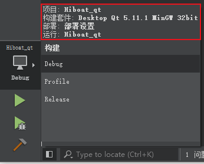
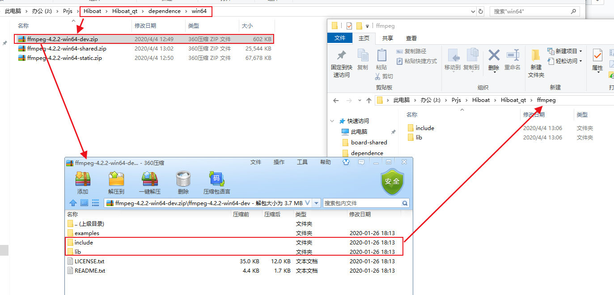
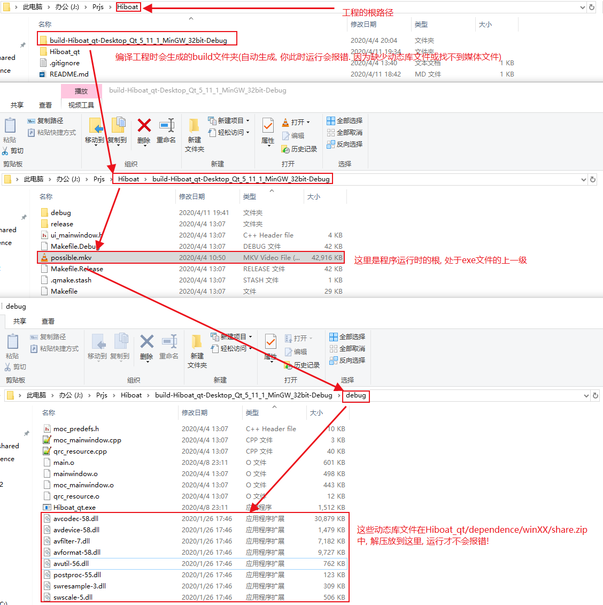

# Hiboat
基于海思Hi3518ev200开发板, 通过wifi rtsp/rtmp/rtp/hls/http传输视频数据(h264/h265/ts)到PC-Qt端, 并将视频流实时显示出来(水印: 时间/帧率/码率), 根据喜好保存为(mp4/ts/avi格式), 并附加人脸/车牌号识别.

# 如何使我们的程序在你的电脑上跑起来.

## 1. 根据自己在QT中选择的构建套件位数选择Hiboat_qt/dependence文件夹中的win32或win64, 打开并解压其中的ffmpeg-4.2.2-win32-dev.zip. 按下图所放置

### (我这里选择了ffmpeg-4.2.2-win64-dev.zip为例)

## 2. 此时你编译(不运行)工程, 在build目录下放置我们运行程序时需要用到的东西.

###恭喜你, 此时你已经可以成功运行整个QT工程了, 如果无法构建, 请提交ISSUES, 我们会尽快给你排查问题.